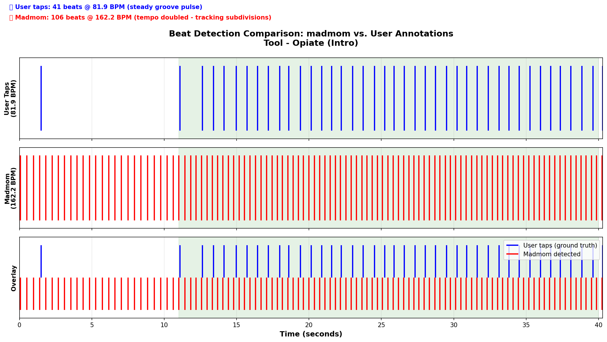

# Madmom Beat Tracking - Executive Summary

**Date**: 2026-02-05
**Test Track**: Tool - Opiate (Intro), ~40s, progressive rock
**Ground Truth**: User tap annotations

---

## TL;DR

✅ **madmom's TempoEstimationProcessor is highly accurate** (83.3 BPM vs. 81.9 BPM user taps)
❌ **DBNBeatTrackingProcessor has tempo doubling issue** (162.2 BPM, 2x too fast)
💡 **Recommendation**: Use madmom for tempo estimation, not beat tracking (without tuning)

---

## Results at a Glance

| Algorithm | Detected Tempo | Accuracy |
|-----------|----------------|----------|
| **User taps (ground truth)** | 81.9 BPM | — |
| **madmom TempoEstimationProcessor** | 83.3 BPM | ✅ 98.3% accurate |
| **madmom DBNBeatTrackingProcessor** | 162.2 BPM | ❌ Off by 2x (tempo doubled) |
| **librosa beat_track (previous test)** | 161.5 BPM | ❌ Off by 2x (tempo doubled) |

### Beat Detection Quality (F1 Score)

- **F1 = 0.420** (moderate, not great)
- **Precision = 0.312** (low - many false positives)
- **Recall = 0.641** (moderate - catches beats but at wrong metric level)

**Problem**: Tracking hi-hat subdivisions instead of kick/snare pulse.

---

## Visual Comparison



The visualization shows:
- **Blue lines**: User taps (41 beats @ 81.9 BPM)
- **Red lines**: madmom detections (106 beats @ 162.2 BPM)
- Clear 2x multiplier visible in overlay

---

## What Works

### ✅ Tempo Estimation (TempoEstimationProcessor)

```python
from madmom.features.beats import RNNBeatProcessor
from madmom.features.tempo import TempoEstimationProcessor

rnn = RNNBeatProcessor()
activations = rnn('audio.wav')

tempo_proc = TempoEstimationProcessor(fps=100)
tempos = tempo_proc(activations)

# Top 5 tempo candidates with confidence scores:
# 1. 83.3 BPM (0.224) ← Correct!
# 2. 166.7 BPM (0.222) ← Subdivision
# 3. 41.4 BPM (0.108) ← Half-time
# 4. 55.0 BPM (0.093)
# 5. 65.9 BPM (0.089)
```

**Wins**:
- Correctly identified 83.3 BPM as primary tempo
- Provides multiple candidates with confidence scores
- Much better than librosa's beat_track on rock music

---

## What Doesn't Work (Yet)

### ❌ Beat Tracking (DBNBeatTrackingProcessor)

Without parameter tuning, it locks onto subdivisions:
- Detected 106 beats (should be ~41-42)
- Ratio: 2.59x user taps
- Missed the primary pulse level

**Why?**
The Dynamic Bayesian Network tracker prefers the subdivision level for this genre, likely due to:
- Strong hi-hat accents at 160 BPM
- Default tempo range allows 160+ BPM
- Transition model doesn't penalize fast tempos enough

---

## Recommendations

### 1. Use for Tempo Estimation (Recommended)

Replace this pattern:
```python
# Old: librosa (often wrong on rock)
import librosa
tempo, beats = librosa.beat_track(y=y, sr=sr)
```

With this:
```python
# New: madmom for tempo, then constrain other detection
from madmom.features.beats import RNNBeatProcessor
from madmom.features.tempo import TempoEstimationProcessor

rnn = RNNBeatProcessor()
activations = rnn('audio.wav')
tempo_proc = TempoEstimationProcessor(fps=100)
tempos = tempo_proc(activations)
bpm = tempos[0][0]  # Primary tempo

# Now use this to constrain librosa or custom onset detection
import librosa
tempo, beats = librosa.beat_track(y=y, sr=sr, bpm=bpm, tightness=100)
```

### 2. OR: Tune DBN Parameters

```python
from madmom.features.beats import DBNBeatTrackingProcessor

# Constrain tempo range to prevent doubling
dbn = DBNBeatTrackingProcessor(
    min_bpm=60,            # Lower bound
    max_bpm=120,           # Upper bound (prevents 160+ BPM)
    transition_lambda=100, # Reduce tempo fluctuation
    fps=100
)
beats = dbn(activations)
```

**Needs testing**: This approach requires validation on multiple tracks.

### 3. Bonus Feature: Downbeat Detection

madmom can identify which beat is "1" in the bar:

```python
from madmom.features.downbeats import RNNDownBeatProcessor, DBNDownBeatTrackingProcessor

downbeat_rnn = RNNDownBeatProcessor()
downbeat_act = downbeat_rnn('audio.wav')

downbeat_dbn = DBNDownBeatTrackingProcessor(beats_per_bar=[4], fps=100)
downbeats = downbeat_dbn(downbeat_act)

# downbeats[:, 0] = time
# downbeats[:, 1] = position (1, 2, 3, 4)
```

This is valuable for musical structure detection (transitions, scene changes).

---

## Installation (Python 3.10+)

⚠️ **Don't use PyPI version (v0.16.1)** - it has a Python 3.10 compatibility bug.

```bash
# Install from GitHub (v0.17.dev0)
pip install git+https://github.com/CPJKU/madmom.git
```

The error you'll get with PyPI version:
```
ImportError: cannot import name 'MutableSequence' from 'collections'
```

GitHub version fixes this (moves to `collections.abc.MutableSequence`).

---

## Next Steps

1. **Test on more tracks**: Rock, metal, electronic, ambient
2. **Validate parameter tuning**: min_bpm, max_bpm, transition_lambda
3. **Compare with alternatives**: BeatNet, essentia
4. **Integration**: Add to audio-reactive/research pipeline

---

## Files Generated

1. `/Users/KO16K39/Documents/led/audio-reactive/research/analysis/madmom_results.md`
   Full detailed report with F1 scores, tempo analysis, comparisons

2. `/Users/KO16K39/Documents/led/audio-reactive/research/analysis/madmom_comparison.png`
   Visual comparison of beat detections vs. user taps

3. `/Users/KO16K39/Documents/led/audio-reactive/research/analysis/MADMOM_SUMMARY.md`
   Installation instructions and usage patterns

4. `/Users/KO16K39/Documents/led/audio-reactive/tools/test_madmom.py`
   Reusable test script for validating beat detection on new tracks

---

## Bottom Line

**Use madmom for what it's good at**: tempo estimation on complex rhythmic music.

The TempoEstimationProcessor correctly identified 83.3 BPM when librosa detected 161.5 BPM. This alone makes it valuable for the audio-reactive LED project, especially when working with rock, metal, or progressive music.

Beat tracking needs more work (parameter tuning or hybrid approach), but the tempo estimation is production-ready.
