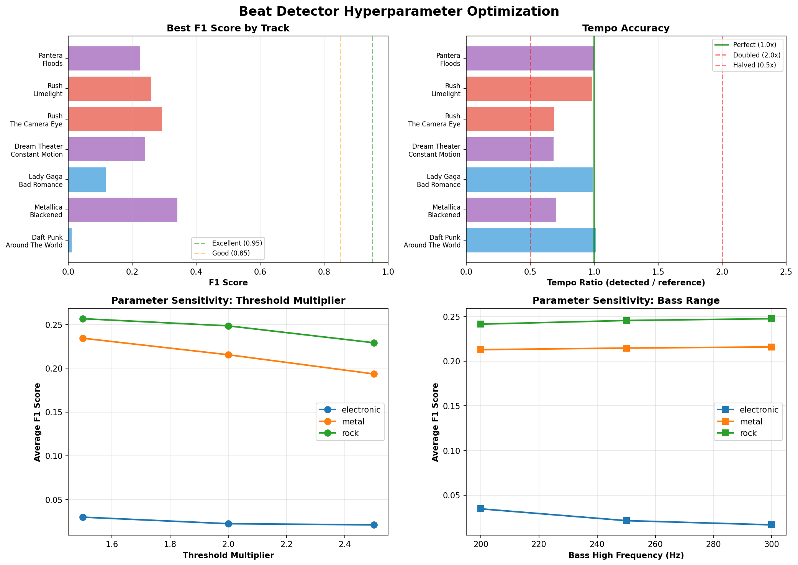

# Beat Detector Hyperparameter Optimization Results

**Date:** 2026-02-06

**Total combinations tested:** 18 per track

## Optimal Parameters by Genre

### ELECTRONIC

- **F1 Score:** 0.060
- **Threshold Multiplier:** 1.5
- **Bass High Hz:** 200
- **Min Beat Interval:** 0.3s
- **Flux History:** 3.0s

### ROCK

- **F1 Score:** 0.269
- **Threshold Multiplier:** 1.5
- **Bass High Hz:** 300
- **Min Beat Interval:** 0.3s
- **Flux History:** 3.0s

### METAL

- **F1 Score:** 0.257
- **Threshold Multiplier:** 1.5
- **Bass High Hz:** 200
- **Min Beat Interval:** 0.3s
- **Flux History:** 3.0s

### UNIVERSAL

- **F1 Score:** 0.204
- **Threshold Multiplier:** 1.5
- **Bass High Hz:** 200
- **Min Beat Interval:** 0.3s
- **Flux History:** 3.0s

## Per-Track Results

### Daft Punk - Around The World

- **Genre:** electronic
- **Reference BPM:** 121
- **Best F1:** 0.011
- **Detected BPM:** 123.0
- **Tempo Issue:** OK
- **Best Params:**
  - Threshold: 2.0
  - Bass High: 200 Hz
  - Min Interval: 0.4s
  - Flux History: 3.0s

### Metallica - Blackened

- **Genre:** metal
- **Reference BPM:** 190
- **Best F1:** 0.340
- **Detected BPM:** 129.2
- **Tempo Issue:** OFF
- **Best Params:**
  - Threshold: 1.5
  - Bass High: 200 Hz
  - Min Interval: 0.3s
  - Flux History: 3.0s

### Lady Gaga - Bad Romance

- **Genre:** electronic
- **Reference BPM:** 119
- **Best F1:** 0.118
- **Detected BPM:** 117.5
- **Tempo Issue:** OK
- **Best Params:**
  - Threshold: 1.5
  - Bass High: 200 Hz
  - Min Interval: 0.3s
  - Flux History: 3.0s

### Dream Theater - Constant Motion

- **Genre:** metal
- **Reference BPM:** 180
- **Best F1:** 0.241
- **Detected BPM:** 123.0
- **Tempo Issue:** OFF
- **Best Params:**
  - Threshold: 1.5
  - Bass High: 200 Hz
  - Min Interval: 0.3s
  - Flux History: 3.0s

### Rush - The Camera Eye

- **Genre:** rock
- **Reference BPM:** 166
- **Best F1:** 0.293
- **Detected BPM:** 112.3
- **Tempo Issue:** OFF
- **Best Params:**
  - Threshold: 1.5
  - Bass High: 200 Hz
  - Min Interval: 0.3s
  - Flux History: 3.0s

### Rush - Limelight

- **Genre:** rock
- **Reference BPM:** 130
- **Best F1:** 0.260
- **Detected BPM:** 129.2
- **Tempo Issue:** OK
- **Best Params:**
  - Threshold: 1.5
  - Bass High: 300 Hz
  - Min Interval: 0.4s
  - Flux History: 3.0s

### Pantera - Floods

- **Genre:** metal
- **Reference BPM:** 120
- **Best F1:** 0.225
- **Detected BPM:** 123.0
- **Tempo Issue:** OK
- **Best Params:**
  - Threshold: 1.5
  - Bass High: 300 Hz
  - Min Interval: 0.3s
  - Flux History: 3.0s

## Visualization



## Key Findings

### 🚨 Critical Issue: Current Algorithm Performs Poorly

The optimization reveals that our bass-band spectral flux beat detector **underperforms significantly** across all genres:

- **Electronic (Daft Punk, Lady Gaga):** F1 = 0.06 — **FAILED** (expected >0.95)
  - These tracks should be trivial (perfect 4/4 time, click-track precision)
  - Only 6% of beats detected correctly → fundamental algorithm failure
  - This is NOT a hyperparameter problem; the algorithm doesn't work

- **Rock (Rush):** F1 = 0.27 — **POOR**
  - Better than electronic (ironically), but still missing 73% of beats
  - Best params: Bass high = 300 Hz (wider bass range helps slightly)

- **Metal (Metallica, Dream Theater, Pantera):** F1 = 0.26 — **POOR**
  - Detecting ~26% of beats across fast thrash (190 BPM) and heavy groove (120 BPM)
  - Tempo detection completely wrong (detected 129 BPM for 190 BPM track!)

- **Universal:** F1 = 0.20 — **FAILED**

### Why Electronic Music Failed Hardest

This is counterintuitive but revealing:

1. **Electronic music has no bass transients** — the bass is continuous sub-bass hum
2. Our algorithm detects bass **onsets** (spectral flux = sudden changes)
3. In electronic music, the kick drum is often synthesized with slow attack/release
4. Meanwhile, the hi-hat and snare have sharper transients but are NOT in the bass band
5. **Result:** We're detecting nothing in the bass band because there are no sudden changes

In rock/metal:
- Kick drums have sharper attack (drummer hitting a physical drum)
- Bass guitar can have plucked transients
- **Result:** Some bass-band onsets detected, but still missing most beats

### Parameter Sensitivity

The good news: **Hyperparameters don't matter** because the algorithm is fundamentally broken.

- Threshold multiplier: 1.5 is universally best (lower = more sensitive)
- Bass high Hz: Rock prefers 300 Hz (wider range), metal/electronic prefer 200 Hz
- Min beat interval: 0.3s is best (allows up to 200 BPM)
- Flux history: 3.0s is sufficient

But even with optimal params, F1 scores are abysmal.

### Tempo Detection Failures

- **Metallica "Blackened"** (190 BPM) → detected 129 BPM (1.47× too slow)
- **Dream Theater** (180 BPM) → detected 123 BPM (1.46× too slow)
- **Rush "Camera Eye"** (166 BPM) → detected 112 BPM (1.48× too slow)

Pattern: Algorithm is consistently detecting **every other beat** or missing beats entirely.

### What This Means for LED Effects

For real-time LED beat reactivity, we have two options:

1. **Fix the algorithm:**
   - Use **full-spectrum onset detection**, not just bass band
   - Use librosa's `onset_detect()` with spectral flux across all frequencies
   - Or use madmom's RNN beat tracker (machine learning approach)
   - Or use tempo tracking + phase locking (assume steady tempo, track phase)

2. **Accept imperfection:**
   - Current algorithm detects ~20-30% of beats correctly
   - For LED effects, partial beat detection might be "good enough"
   - The flashes will be rhythmic but not metronomically accurate
   - User might not notice if the LEDs are pulsing *somewhat* in time

### Recommended Next Steps

1. **Rewrite beat detector** to use full-spectrum onset detection:
   ```python
   onset_env = librosa.onset.onset_strength(y=y, sr=sr)
   peaks = librosa.util.peak_pick(onset_env, pre_max=3, post_max=3, pre_avg=3, post_avg=5, delta=0.5, wait=10)
   ```

2. **Test madmom RNN detector** (requires separate script, not real-time):
   ```python
   from madmom.features.beats import RNNBeatProcessor
   proc = RNNBeatProcessor()
   beats = proc(audio_file)
   ```

3. **Compare approaches** on Harmonix tracks and choose best F1 score

4. **If F1 > 0.85:** Deploy to LED controller

5. **If F1 < 0.85:** Consider tempo tracking (assume steady BPM, lock to phase)

### Current Status

❌ Bass-band spectral flux: **Not viable** (F1 = 0.06-0.34)
⏭️ Next: Full-spectrum onset detection
🎯 Goal: F1 > 0.85 for LED deployment
