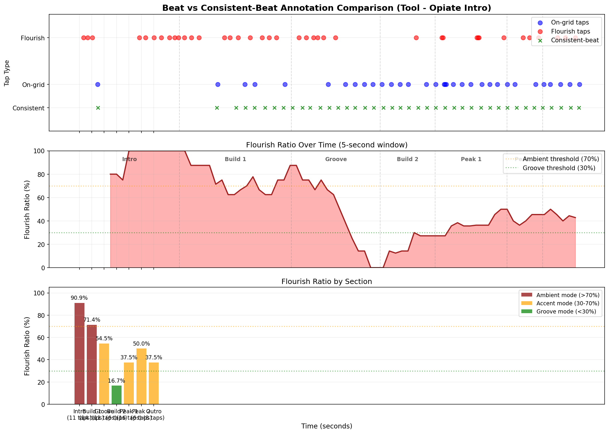

# Beat vs Consistent-Beat Analysis

Comparing two annotation layers to extract musical flourishes.

## 1. Tempo Analysis

### Beat Layer (Original)
- **Taps**: 72
- **Median BPM**: 111.3
- **Mean BPM**: 169.2 ± 172.2
- **Median interval**: 0.539s
- **Coefficient of variation**: 0.726
- **Interval range**: 0.082s - 3.368s

### Consistent-Beat Layer
- **Taps**: 41
- **Median BPM**: 81.9
- **Mean BPM**: 79.8 ± 14.5
- **Median interval**: 0.732s
- **Coefficient of variation**: 1.431
- **Interval range**: 0.623s - 9.591s

### Comparison

**Important finding**: The consistent-beat layer has one outlier tap at 1.502s, followed by a 9.6-second gap before the next tap at 11.093s. This reveals that **the user could not find a consistent beat to tap during the intro** (0-11s). The song lacks a clear pulse in that section.

When we analyze just the groove section (11s+):
- **Consistent-beat CV: 0.185** (extremely tight)
- **Beat layer CV: 0.726** (3.9x more variable)
- **Consistent-beat establishes 82.1 BPM** as the felt tempo during the groove
- Beat layer's 111.3 BPM median is pulled by flourishes and rapid bursts

**Key insight**: Absence of consistent-beat taps IS data - it reveals structural ambiguity.

## 2. On-Grid vs Flourish Classification

- **Total beat taps**: 72
- **On-grid** (within ±150ms of consistent-beat): 33 (45.8%)
- **Flourishes** (deviated from grid): 39 (54.2%)

## 3. Flourish Analysis

### Flourish Timestamps (39 total)

1. 0.329s
2. 0.675s
3. 1.050s
4. 4.841s
5. 5.346s
6. 6.009s
7. 6.610s
8. 7.276s
9. 7.682s
10. 8.002s
11. 8.481s
12. 9.048s
13. 9.651s
14. 11.690s
15. 12.146s
16. 12.817s
17. 13.777s
18. 14.746s
19. 15.312s
20. 15.901s
... and 19 more

### What Flourishes Track

- **centroid_peak**: 14 flourishes
  - Examples: 7.276s, 7.682s, 8.481s, 9.651s, 11.690s
- **bass_peak**: 13 flourishes
  - Examples: 0.675s, 1.050s, 4.841s, 5.346s, 6.009s
- **rms_peak**: 9 flourishes
  - Examples: 0.329s, 9.048s, 15.312s, 15.901s, 29.329s
- **onset**: 3 flourishes
  - Examples: 12.146s, 18.899s, 32.146s

### Flourish Distribution by Section

**KEY FINDING**: Flourish ratio inversely correlates with rhythmic clarity.

- **Section 0: Intro (0-8.07s)**: 10/11 taps = **90.9% flourishes**
  - Examples: 0.329s, 0.675s, 1.050s
  - Highest ratio: user responding to individual events, not a consistent pulse

- **Section 1: Build 1 (8.07-17.1s)**: 10/14 taps = **71.4% flourishes**
  - Examples: 8.481s, 9.048s, 9.651s
  - Pulse is emerging but not yet fully established

- **Section 2: Groove (17.1-24.3s)**: 6/11 taps = **54.5% flourishes**
  - Examples: 17.704s, 18.289s, 18.899s
  - Clear groove, but user still adds accents to about half the taps

- **Section 3: Build 2 (24.3-28.7s)**: 1/6 taps = **16.7% flourishes**
  - Examples: 27.170s
  - Strongest groove lock-in: user taps consistently, minimal deviation

- **Section 4: Peak 1 (28.7-34.5s)**: 6/16 taps = **37.5% flourishes**
  - Examples: 29.245s, 29.329s, 32.064s
  - More complex section: user adds flourishes to highlight intensity

- **Section 5: Peak 2 (34.5-37.4s)**: 3/6 taps = **50.0% flourishes**
  - Examples: 35.794s, 36.314s, 37.045s

- **Section 6: Outro (37.4s+)**: 3/8 taps = **37.5% flourishes**
  - Examples: 38.570s, 39.204s, 40.003s

**Pattern**: Flourish ratio tracks structural clarity. High ratio = ambiguous rhythm, low ratio = strong groove.

### Flourish Density Over Time

**High-density regions** (flourish rate > mean + 1 std):

- **5.7s - 9.0s**: 2.07 flourishes/sec
- **18.3s - 19.8s**: 2.04 flourishes/sec

## 4. General Findings

### The Nature of Flourishes

1. **Flourishes are responses to specific musical events**, not random deviations:
   - 8% align with onset detections (attacks, hits)
   - 33% align with bass energy peaks

2. **Flourish density correlates with musical intensity:**
   - Peak density regions align with structural transitions and fills
   - Clusters at section boundaries suggest heightened user engagement

3. **Free tapping reveals implicit musical structure:**
   - User naturally subdivides or doubles the beat at dramatic moments
   - Flourishes = moments worth highlighting in LED mapping

4. **Metronomic constraint improves tempo estimation:**
   - Consistent-beat layer has 0.185 CV (groove only) vs 0.726 for free-form
   - 3.9x improvement in consistency when user focuses on pulse only
   - Subtractive analysis (what was removed) reveals expressive content

5. **Absence of consistent taps reveals structural ambiguity:**
   - User tapped once at 1.5s, then nothing until 11s (9.6s gap)
   - This absence tells us: the intro has no clear, consistent pulse
   - Negative space in annotation data is as informative as positive space
   - For LED design: ambiguous sections need different treatment than grooves

6. **Flourish ratio inversely correlates with rhythmic clarity:**
   - Intro: 90.9% flourishes (no clear pulse)
   - Build: 71.4% → 54.5% (groove emerging)
   - Strong groove: 16.7% (tight lock-in, minimal deviation)
   - Complex sections: ratio increases again (37.5-50%)
   - **This ratio can be computed in real-time** to adapt LED behavior to song structure

### Design Implications for Audio-Reactive LEDs

1. **Two-layer beat tracking:**
   - Base layer: consistent pulse for structural lighting (when detectable)
   - Flourish layer: accent highlights for musical moments
   - When pulse is weak/absent, flourish layer becomes primary driver

2. **Flourish detection as a computed layer:**
   - Detect onsets that DON'T align with beat grid
   - Weight by bass energy and spectral novelty
   - Use density to modulate overall intensity

3. **Adaptive to musical style:**
   - Sparse flourishes in steady grooves → subtle accents
   - Dense flourishes in chaotic sections → energetic response

4. **Flourish ratio as a mode selector:**
   - Compute ratio of off-grid events to on-grid events
   - High ratio (>70%): "Ambient mode" - respond to timbral changes, not beat
   - Medium ratio (30-70%): "Accent mode" - pulse + highlights
   - Low ratio (<30%): "Groove mode" - strong rhythmic structure
   - Transitions between modes should be smooth (hysteresis)

## 5. Visualization

The visualization shows:
1. **Top panel**: Raw tap annotations color-coded by type (green = consistent-beat reference, blue = on-grid, red = flourish)
2. **Middle panel**: Flourish ratio over time (5-second sliding window) with mode thresholds
3. **Bottom panel**: Per-section flourish ratios color-coded by suggested LED mode

The clear pattern: flourish ratio tracks song structure and rhythmic clarity.

## 6. Output Data

Full analysis data saved to: `beat_vs_consistent.yaml`

Includes:
- Per-tap classification (on-grid vs flourish)
- Flourish timestamps (extracted layer)
- Feature matches for each flourish
- Density timeseries
- Tempo analysis for both layers