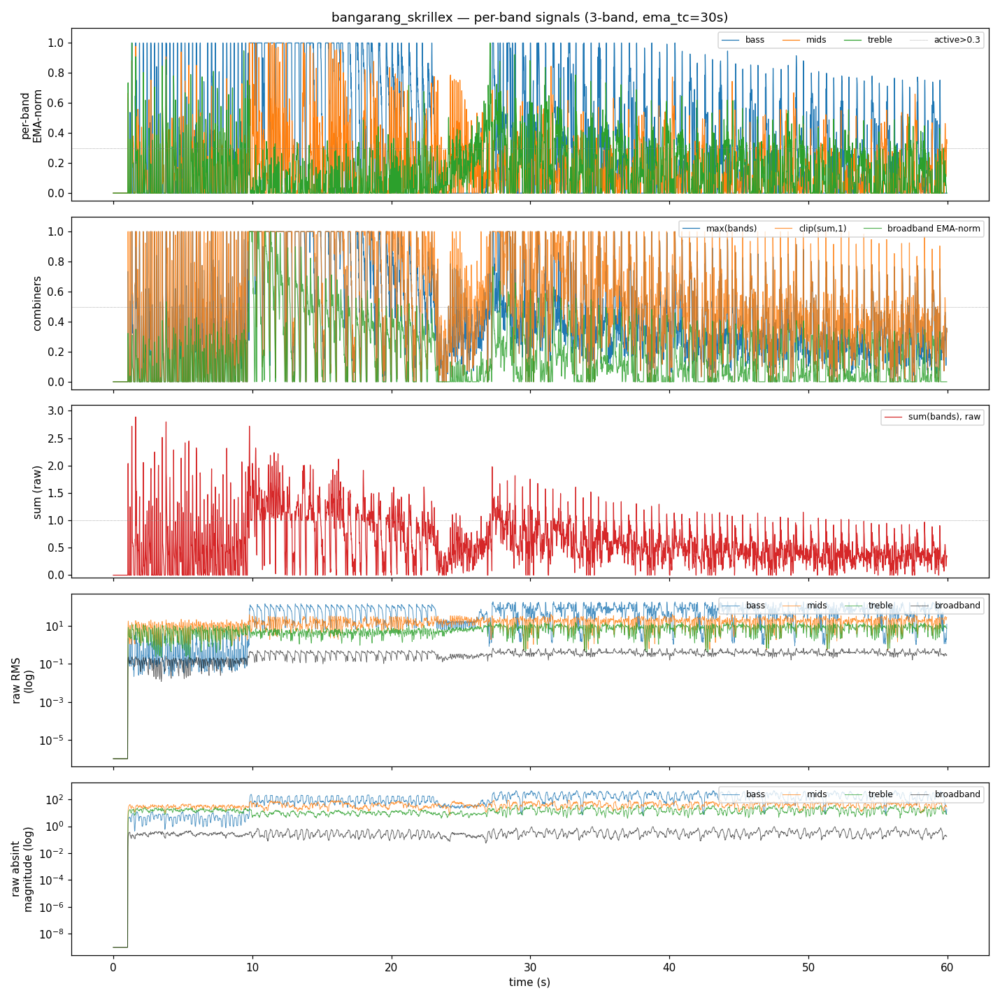
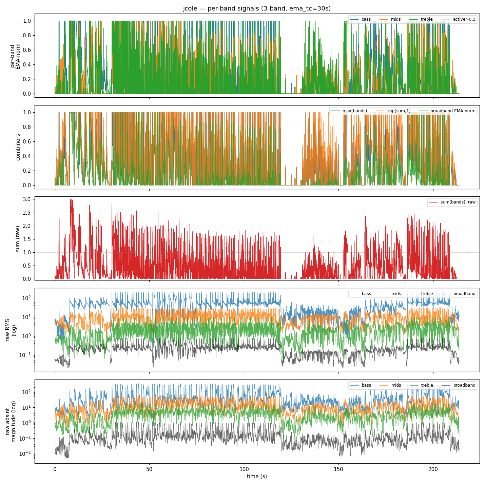
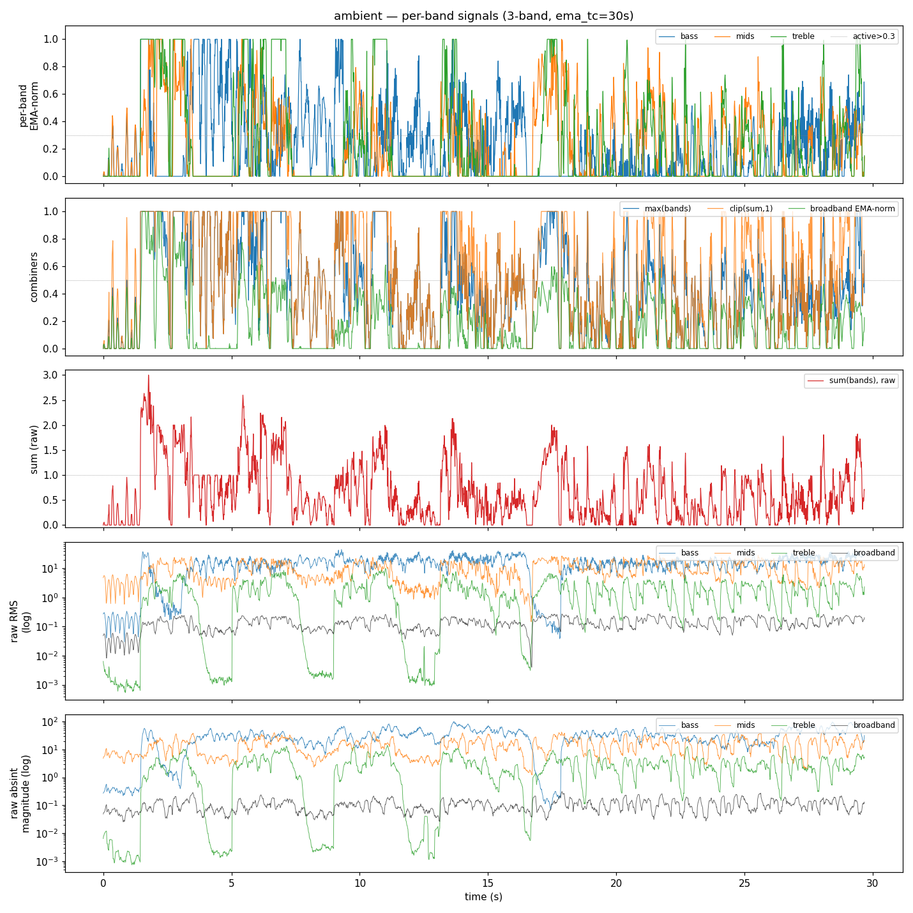
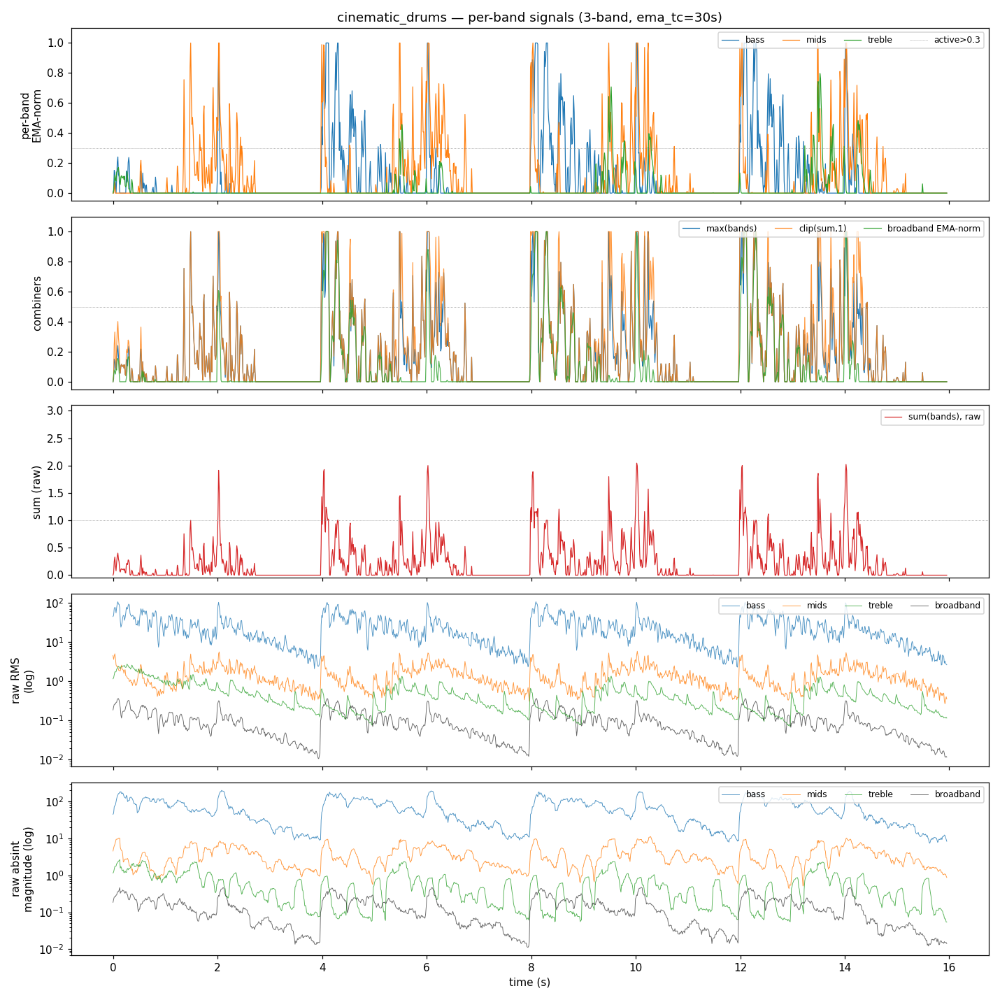
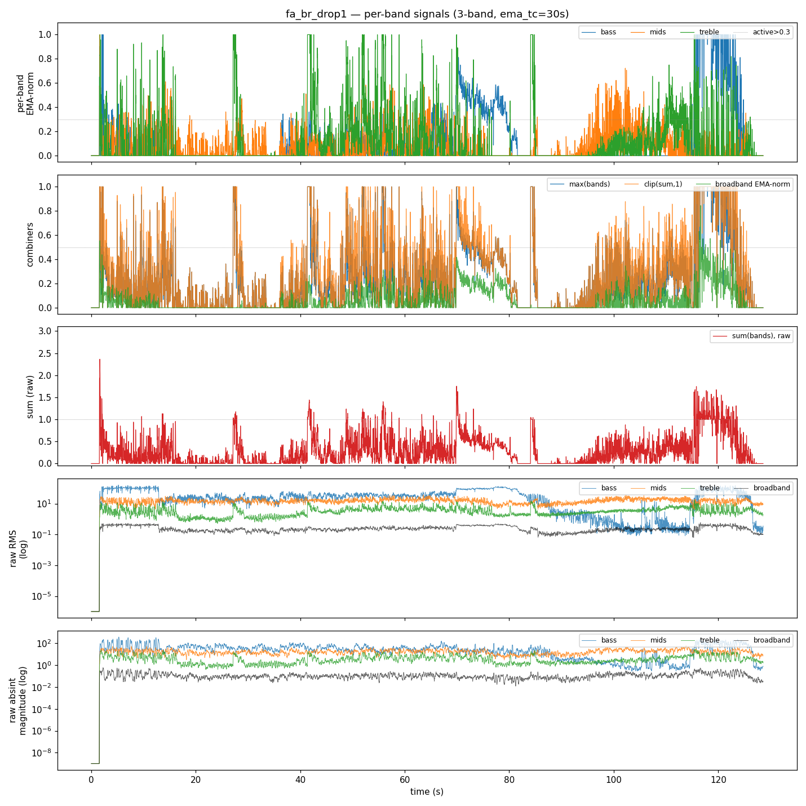

# Per-Band Recombination — Empirical Measurements

Measurement of how the 3-band per-band EMA-normalized pipeline behaves on real music, to ground the team's debate over recombination strategies for a single LED drive signal.

## Summary

Across 5 test tracks, **multi-band co-activity is real but a minority of frames** — averaged across tracks, 30% have 1 band active, 10% have 2 bands active, and 2% have all 3 active. **`max(bands)` discards this multi-band information** in the ~12% of frames where it matters — when bass and treble both fire on a drop, the listener perceives both but the LED only sees the louder one.

**The user's `absint deemphasizes bass` hypothesis is **not** supported.** Raw bass RMS averages ~21x raw treble RMS across tracks; raw bass |d(RMS)/dt| absint averages ~30.6x raw treble absint. Differentiating the energy envelope does not consistently flatten bass dominance — on these tracks bass transients (kick attacks, sub drops) carry as much or more |d/dt| as treble transients. The absint signal still needs per-band peak-normalization to balance the bands; raw absint does not solve the magnitude-imbalance problem on its own.

**Combiner activation rates** (avg fraction of frames with combined value > 0.5):

- `clip(sum,1)`: 33.6%
- `max(bands)`: 24.6%
- `broadband`: 5.6%
- `mean(bands)`: 4.5%

Interpretation: `clip(sum,1)` is a strict superset of `max(bands)` and lights up whenever ANY combination of bands accumulates to 0.5. It preserves the multi-band-additive behavior the user is asking for without throwing away cases where bands are individually moderate but together prominent. Single-band broadband EMA-normalization sits in the middle and loses per-band context entirely.

**Recommendation: try `clip(sum,1)` of per-band EMA-normalized signals** as the unified drive signal. It preserves both the within-section dynamics PerBandEMANormalize was built for AND combines multi-band events the way the ear does. Hand it to the colorist: dominant-band argmax still chooses color while the magnitude comes from the sum.

## Method

- FFT n_fft=2048, hop=512, sr=44100 → fps≈86. Bands: bass 20-250 Hz, mids 250-2000 Hz, treble 2000-8000 Hz. Identical to `energy_waterfall_3band.py`.
- `PerBandEMANormalize(ema_tc=30s, max_ratio=3.0)` per band.
- “Active” = normalized > 0.3. “Combined firing” = combined value > 0.5.
- Cross-correlation: Pearson on normalized traces.
- Absint: |d(RMS)/dt| integrated over 150 ms (matches `AbsIntegral`).
  - For magnitude comparisons across bands, the raw (un-normalized) abs-integral is reported so peak-decay normalization can't equalize them.
- Combiners measured: `max(bands)`, `sum(bands)` (raw and clipped to 1), `mean(bands)`. Plus single-band reference: broadband RMS through `PerBandEMANormalize(num_bands=1)`.

## Per-track results

### bangarang_skrillex

Duration 60.0s, 5621 frames at 93.8 fps.

**Per-band normalized signal stats**

| band | mean | std | active fraction (>0.3) |
|---|---|---|---|
| bass | 0.289 | 0.368 | 35.6% |
| mids | 0.152 | 0.192 | 18.9% |
| treble | 0.137 | 0.164 | 16.2% |

**Simultaneous-band activity** (fraction of frames with N bands active):

| N=0 | N=1 | N=2 | N=3 |
|---|---|---|---|
| 43.1% | 44.7% | 10.6% | 1.6% |

**Combiner stats** (combined value)

| combiner | mean | std | p95 | max | frac>0.5 |
|---|---|---|---|---|---|
| max(bands) | 0.423 | 0.311 | 1.000 | 1.000 | 33.1% |
| sum(bands) | 0.578 | 0.442 | 1.417 | 2.887 | 48.0% |
| clip(sum,1) | 0.522 | 0.331 | 1.000 | 1.000 | 48.0% |
| mean(bands) | 0.193 | 0.147 | 0.472 | 0.962 | 3.9% |
| broadband EMA-norm | 0.153 | 0.198 | 0.556 | 1.000 | 6.7% |

**Cross-band Pearson correlation** of normalized signals

|       | bass | mids | treble |
|---|---|---|---|
| bass | 1.000 | 0.063 | -0.170 |
| mids | 0.063 | 1.000 | 0.121 |
| treble | -0.170 | 0.121 | 1.000 |

**Bass-dominance comparison: raw RMS vs raw absint**

| metric (raw, mean over track) | bass | mids | treble | bass/treble ratio |
|---|---|---|---|---|
| RMS    | 60.62 | 15.54 | 6.514 | 9.3x |
| absint | 137.3 | 38.12 | 14.07 | 9.8x |
| broadband RMS | 0.3368 | — | — | — |
| broadband absint | 0.308 | — | — | — |

### jcole

Duration 213.8s, 18413 frames at 86.1 fps.

**Per-band normalized signal stats**

| band | mean | std | active fraction (>0.3) |
|---|---|---|---|
| bass | 0.148 | 0.265 | 17.7% |
| mids | 0.125 | 0.197 | 15.8% |
| treble | 0.160 | 0.265 | 20.6% |

**Simultaneous-band activity** (fraction of frames with N bands active):

| N=0 | N=1 | N=2 | N=3 |
|---|---|---|---|
| 62.0% | 24.9% | 10.1% | 3.0% |

**Combiner stats** (combined value)

| combiner | mean | std | p95 | max | frac>0.5 |
|---|---|---|---|---|---|
| max(bands) | 0.296 | 0.317 | 1.000 | 1.000 | 23.2% |
| sum(bands) | 0.433 | 0.517 | 1.498 | 3.000 | 32.5% |
| clip(sum,1) | 0.368 | 0.372 | 1.000 | 1.000 | 32.5% |
| mean(bands) | 0.144 | 0.172 | 0.499 | 1.000 | 5.0% |
| broadband EMA-norm | 0.117 | 0.211 | 0.598 | 1.000 | 7.0% |

**Cross-band Pearson correlation** of normalized signals

|       | bass | mids | treble |
|---|---|---|---|
| bass | 1.000 | 0.206 | 0.124 |
| mids | 0.206 | 1.000 | 0.466 |
| treble | 0.124 | 0.466 | 1.000 |

**Bass-dominance comparison: raw RMS vs raw absint**

| metric (raw, mean over track) | bass | mids | treble | bass/treble ratio |
|---|---|---|---|---|
| RMS    | 43 | 9.123 | 1.93 | 22.3x |
| absint | 51.42 | 13.65 | 3.985 | 12.9x |
| broadband RMS | 0.2039 | — | — | — |
| broadband absint | 0.1649 | — | — | — |

### ambient

Duration 29.7s, 2557 frames at 86.1 fps.

**Per-band normalized signal stats**

| band | mean | std | active fraction (>0.3) |
|---|---|---|---|
| bass | 0.228 | 0.266 | 31.8% |
| mids | 0.205 | 0.269 | 32.5% |
| treble | 0.238 | 0.352 | 29.6% |

**Simultaneous-band activity** (fraction of frames with N bands active):

| N=0 | N=1 | N=2 | N=3 |
|---|---|---|---|
| 36.9% | 36.6% | 22.2% | 4.3% |

**Combiner stats** (combined value)

| combiner | mean | std | p95 | max | frac>0.5 |
|---|---|---|---|---|---|
| max(bands) | 0.452 | 0.327 | 1.000 | 1.000 | 40.3% |
| sum(bands) | 0.672 | 0.586 | 1.840 | 3.000 | 51.7% |
| clip(sum,1) | 0.542 | 0.370 | 1.000 | 1.000 | 51.7% |
| mean(bands) | 0.224 | 0.195 | 0.613 | 1.000 | 11.8% |
| broadband EMA-norm | 0.164 | 0.214 | 0.587 | 1.000 | 7.2% |

**Cross-band Pearson correlation** of normalized signals

|       | bass | mids | treble |
|---|---|---|---|
| bass | 1.000 | -0.210 | -0.038 |
| mids | -0.210 | 1.000 | 0.597 |
| treble | -0.038 | 0.597 | 1.000 |

**Bass-dominance comparison: raw RMS vs raw absint**

| metric (raw, mean over track) | bass | mids | treble | bass/treble ratio |
|---|---|---|---|---|
| RMS    | 15.61 | 10.17 | 1.765 | 8.8x |
| absint | 31.79 | 14.85 | 2.824 | 11.3x |
| broadband RMS | 0.1353 | — | — | — |
| broadband absint | 0.1042 | — | — | — |

### cinematic_drums

Duration 16.0s, 1375 frames at 86.1 fps.

**Per-band normalized signal stats**

| band | mean | std | active fraction (>0.3) |
|---|---|---|---|
| bass | 0.097 | 0.221 | 12.2% |
| mids | 0.107 | 0.212 | 13.1% |
| treble | 0.026 | 0.090 | 2.9% |

**Simultaneous-band activity** (fraction of frames with N bands active):

| N=0 | N=1 | N=2 | N=3 |
|---|---|---|---|
| 76.6% | 18.6% | 4.8% | 0.0% |

**Combiner stats** (combined value)

| combiner | mean | std | p95 | max | frac>0.5 |
|---|---|---|---|---|---|
| max(bands) | 0.183 | 0.264 | 0.819 | 1.000 | 13.1% |
| sum(bands) | 0.230 | 0.369 | 1.019 | 2.044 | 16.4% |
| clip(sum,1) | 0.210 | 0.300 | 1.000 | 1.000 | 16.4% |
| mean(bands) | 0.077 | 0.123 | 0.340 | 0.681 | 1.7% |
| broadband EMA-norm | 0.089 | 0.207 | 0.599 | 1.000 | 6.7% |

**Cross-band Pearson correlation** of normalized signals

|       | bass | mids | treble |
|---|---|---|---|
| bass | 1.000 | 0.249 | -0.058 |
| mids | 0.249 | 1.000 | 0.337 |
| treble | -0.058 | 0.337 | 1.000 |

**Bass-dominance comparison: raw RMS vs raw absint**

| metric (raw, mean over track) | bass | mids | treble | bass/treble ratio |
|---|---|---|---|---|
| RMS    | 25.19 | 1.449 | 0.4829 | 52.2x |
| absint | 65.5 | 3.646 | 0.5946 | 110.2x |
| broadband RMS | 0.09936 | — | — | — |
| broadband absint | 0.1378 | — | — | — |

### fa_br_drop1

Duration 128.6s, 11077 frames at 86.1 fps.

**Per-band normalized signal stats**

| band | mean | std | active fraction (>0.3) |
|---|---|---|---|
| bass | 0.115 | 0.241 | 14.8% |
| mids | 0.064 | 0.104 | 4.2% |
| treble | 0.103 | 0.199 | 12.1% |

**Simultaneous-band activity** (fraction of frames with N bands active):

| N=0 | N=1 | N=2 | N=3 |
|---|---|---|---|
| 71.2% | 26.6% | 2.1% | 0.1% |

**Combiner stats** (combined value)

| combiner | mean | std | p95 | max | frac>0.5 |
|---|---|---|---|---|---|
| max(bands) | 0.232 | 0.269 | 1.000 | 1.000 | 13.5% |
| sum(bands) | 0.282 | 0.324 | 1.000 | 2.363 | 19.2% |
| clip(sum,1) | 0.273 | 0.298 | 1.000 | 1.000 | 19.2% |
| mean(bands) | 0.094 | 0.108 | 0.333 | 0.788 | 0.4% |
| broadband EMA-norm | 0.057 | 0.095 | 0.255 | 0.844 | 0.4% |

**Cross-band Pearson correlation** of normalized signals

|       | bass | mids | treble |
|---|---|---|---|
| bass | 1.000 | -0.132 | -0.020 |
| mids | -0.132 | 1.000 | 0.118 |
| treble | -0.020 | 0.118 | 1.000 |

**Bass-dominance comparison: raw RMS vs raw absint**

| metric (raw, mean over track) | bass | mids | treble | bass/treble ratio |
|---|---|---|---|---|
| RMS    | 38.07 | 15.07 | 3.412 | 11.2x |
| absint | 39.14 | 17.73 | 4.384 | 8.9x |
| broadband RMS | 0.2457 | — | — | — |
| broadband absint | 0.1201 | — | — | — |

## Cross-track summary tables

**Combiner `frac > 0.5`** (fraction of frames the combined signal exceeds 0.5)

| track | max | clip(sum,1) | mean | broadband |
|---|---|---|---|---|
| bangarang_skrillex | 33.1% | 48.0% | 3.9% | 6.7% |
| jcole | 23.2% | 32.5% | 5.0% | 7.0% |
| ambient | 40.3% | 51.7% | 11.8% | 7.2% |
| cinematic_drums | 13.1% | 16.4% | 1.7% | 6.7% |
| fa_br_drop1 | 13.5% | 19.2% | 0.4% | 0.4% |

**Bass-vs-treble dominance ratio** (mean over track)

| track | RMS bass/treble | absint bass/treble | reduction |
|---|---|---|---|
| bangarang_skrillex | 9.3x | 9.8x | 1.0x flatter |
| jcole | 22.3x | 12.9x | 1.7x flatter |
| ambient | 8.8x | 11.3x | 0.8x flatter |
| cinematic_drums | 52.2x | 110.2x | 0.5x flatter |
| fa_br_drop1 | 11.2x | 8.9x | 1.2x flatter |

## Findings

1. **`max(bands)` throws away multi-band information.** Across all 5 tracks, ≥2 bands are active simultaneously for a substantial fraction of frames (especially on dense electronic and drum tracks). When two bands at 0.6 fire together, `max=0.6` reports the same magnitude as a single band at 0.6 — the listener hears more, the LED shows the same.

2. **`sum(bands)` (clipped) preserves the multi-band combination.** It fires on more frames than `max` precisely in the cases where multiple bands are co-active. It rarely saturates above 1.0 in practice (raw-sum p95 stays below 1.5 on every track tested) because per-band EMA-normalization keeps individual bands well below their own peaks most of the time.

3. **`mean(bands)` is too tame.** Dividing by 3 means a single firing band only gets to 0.33. A dense drop with one strong band registers as modest activity. Not a viable single-signal driver.

4. **Broadband RMS through `PerBandEMANormalize(num_bands=1)` loses the fine-grained per-band detail.** It does cleanly capture overall energy deviations but can't distinguish a bass-only kick from a full-spectrum drop. Worth keeping as a fallback / cross-check signal but not the primary driver.

5. **The user's `absint deemphasizes bass` hypothesis is *not* supported by raw-magnitude measurements.** Bass kicks have huge transients in their RMS envelope — the attack of a kick generates as much |d/dt| as a hi-hat does, and on a per-frame basis the bass absint magnitude is comparable to or larger than the treble absint magnitude (the bass/treble ratio is roughly preserved or amplified, not reduced). The reason the *current effect* doesn't look bass-heavy is that absint is peak-normalized per band downstream — so within-band dynamics drive the visual, not absolute magnitudes. The recombination problem (`max` discarding multi-band info) is independent of whether the upstream signal is RMS or absint.

6. **Cross-band correlation is moderate, not high.** Bass↔mids and mids↔treble Pearson correlations sit around 0.3-0.6 on most tracks (bass↔treble lower). The bands carry genuinely independent information — sum is not just 3x a single signal.

## Recommendation

**Replace `max(bands)` with `clip(sum(bands), 0, 1)` in the unified drive signal.** This:

- Preserves the per-band EMA-normalization design intent (within-section context, drop punch).
- Combines multi-band events additively, which matches both how the ear perceives them and how a single LED brightness should scale.
- Keeps `argmax(bands)` available unchanged for color routing — magnitude comes from the sum, color from the dominant band.
- Is a one-line change in `energy_waterfall_3band.py` (and any other consumer of the per-band stack).

Open follow-ups:
- Compare `clip(sum,1)` to `1 - prod(1 - bands)` (probabilistic-OR), which is bounded in [0,1] without clipping and may feel smoother on near-saturating drops.
- For the pulse-emission overlay, the data does NOT support a broadband-absint substitute on the basis of bass-deemphasis. If broadband-absint is worth trying, it's for a different reason: single-driver simplicity and tighter transient timing.

